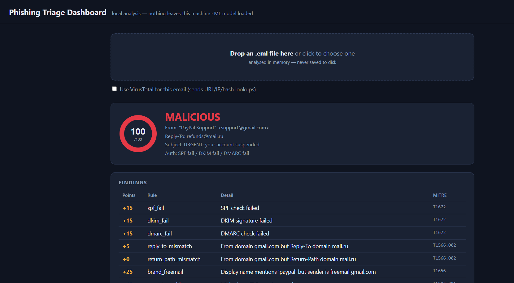
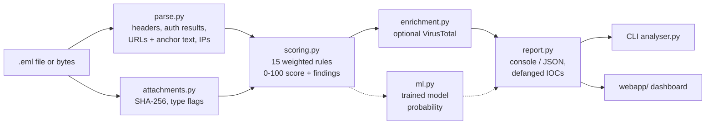
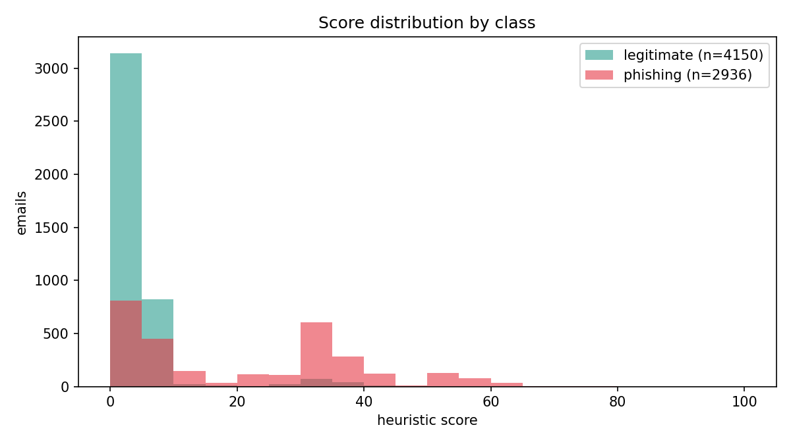
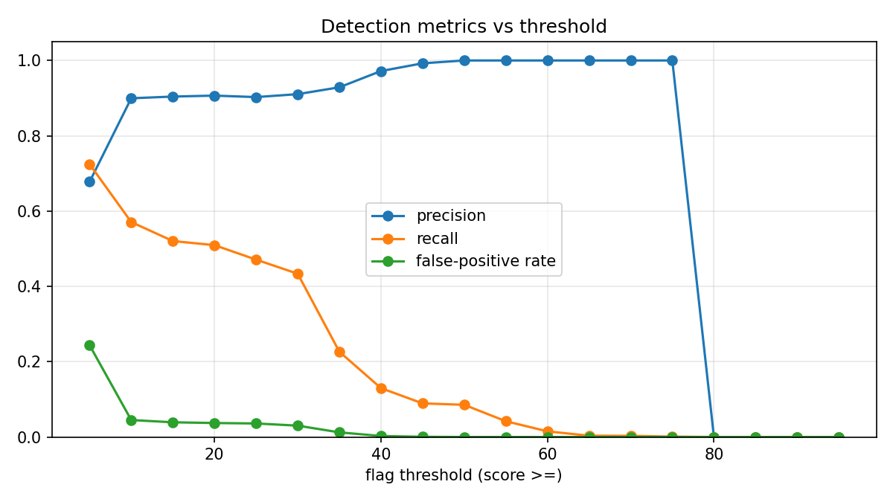
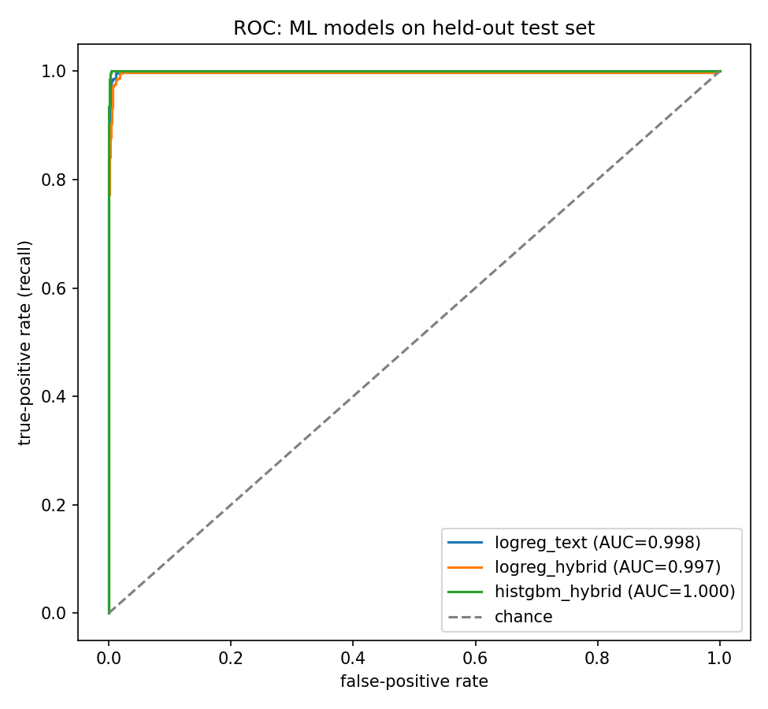
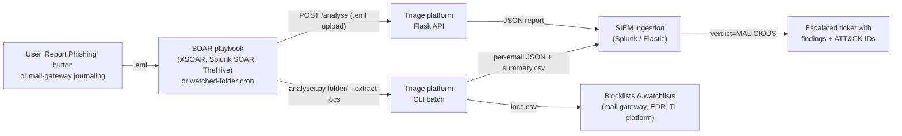

# Phishing Triage Platform

[](https://github.com/Zakashaikh/phishing-triage-platform/actions/workflows/tests.yml)

A phishing email detector built and **measured like a detection-engineering project**, not a script: 15 explainable, MITRE ATT&CK-mapped heuristic rules, evaluated against **7,095 real emails**, tuned on the evidence, then benchmarked against trained ML models — all wrapped in a CLI and a local triage dashboard.

**Headline results** (held-out data, details below):

| Detector | Precision | Recall | FP rate |
|---|---:|---:|---:|
| Hand-written rules (flag at score ≥ 20) | 0.89 | 0.51 | 4.7% |
| Gradient-boosting hybrid (rules + text features) | **0.995** | **1.000** | **0.4%** |

> The rules run fully offline and explain every point they award. The ML model nearly doubles recall on the corpus — with honest caveats about *why* documented in [evaluation/RESULTS.md](evaluation/RESULTS.md).

---

## The dashboard

Drop an `.eml` file on the page and get a triage view: score gauge, verdict, the red-flag findings with ATT&CK technique tags, ML probability, defanged IOCs, and a safe (fully escaped) body preview with the deceptive links highlighted.

```
venv\Scripts\python.exe webapp\app.py     →  http://127.0.0.1:5000
```

Uploads are analysed **in memory only** — never written to disk. Analysis is offline by default; VirusTotal is per-request opt-in when a key is configured.



## Quickstart

```powershell
python -m venv venv
venv\Scripts\python.exe -m pip install -r requirements.txt

# analyse one email (offline heuristics only)
venv\Scripts\python.exe analyser.py sample.eml --no-api

# add the trained ML model's probability
venv\Scripts\python.exe analyser.py sample.eml --no-api --ml

# bulk-triage a folder -> per-email JSON reports + summary.csv
venv\Scripts\python.exe analyser.py C:\path\to\inbox --output reports

# also extract a blocklist-ready IOC list from everything that scored
venv\Scripts\python.exe analyser.py C:\path\to\inbox --output reports --extract-iocs

# run the test suite (102 tests)
venv\Scripts\python.exe -m pytest tests -q
```

Or with Docker (dashboard on http://localhost:5000):

```bash
docker build -t phishing-triage .
docker run --rm -p 5000:5000 phishing-triage
```

Optional VirusTotal enrichment: put `VIRUSTOTAL_API_KEY=...` in a `.env` file. Without it the analyser runs identically and marks VT lookups as skipped.

Sample CLI output:

```
SCORE: 55/100  (MALICIOUS)

--- FINDINGS ---
  +10  spf_fail               SPF soft-failed [T1672]
  +15  dkim_fail              DKIM signature failed [T1672]
  +15  dmarc_fail             DMARC check failed [T1672]
  +21  urgency_language       Urgency/credential language: urgent, immediately, ... [T1656]

--- URLS ---
  hxxp://www[.]eicar[.]org/download/eicar[.]com

FINAL VERDICT: MALICIOUS
```

## Architecture



| Module | Responsibility |
|---|---|
| `parse.py` | `.eml` → structured dict: decoded headers, SPF/DKIM/DMARC, URLs with anchor text, public IPs. Never crashes on malformed mail. |
| `attachments.py` | MIME walk → filename, type, size, SHA-256, dangerous-extension / macro flags. Content is hashed, never executed or persisted. |
| `scoring.py` | The detection engine: each rule returns a finding `(points, detail, MITRE id)`; aggregate score → CLEAN / SUSPICIOUS / MALICIOUS. |
| `enrichment.py` | Optional VT lookups (URL, IP, file hash) that degrade gracefully — every failure mode returns a labelled result, never an exception. |
| `ml.py` + `evaluation/` | Feature extraction, training/comparison, persisted model, corpus download and metrics. |
| `report.py` / `analyser.py` / `webapp/` | Reporting (dual verdicts, defanged IOCs) and the two front ends sharing one pipeline entry point. |

## How scoring works

Every rule is a small pure function; the report shows exactly which fired and why. Weights are **not hand-picked** — they were tuned against the evaluation corpus (next section).

| Rule | Signal | Points | ATT&CK |
|---|---|---:|---|
| `spf_fail` | SPF fail / softfail | 15 / 10 | T1672 |
| `dkim_fail` | DKIM signature failed | 15 | T1672 |
| `dmarc_fail` | DMARC failed | 15 | T1672 |
| `reply_to_mismatch` | Reply-To domain ≠ From domain | 5 | T1566.002 |
| `return_path_mismatch` | Return-Path domain ≠ From domain | 0 (informational) | T1566.002 |
| `brand_freemail` | Brand display name, freemail sender | 25 | T1656 |
| `link_text_mismatch` | Anchor text domain ≠ real href domain | 30 | T1566.002 |
| `lookalike_domain` | Edit-distance ≤ 2 from a known brand | 25 | T1583.001 |
| `punycode_domain` | IDN/punycode (`xn--`) domain | 15 | T1583.001 |
| `raw_ip_url` | URL host is a literal IP | 20 | T1566.002 |
| `url_shortener` | Known shortener hides destination | 10 | T1566.002 |
| `suspicious_tld` | High-abuse TLD (.top, .zip, …) | 10 | T1583.001 |
| `urgency_language` | Urgency/credential keywords | 7 each, cap 21 | T1656 |
| `dangerous_attachment` | Executable/script attachment, double extension | 30 | T1566.001 |
| `macro_attachment` | Macro-enabled Office document | 25 | T1566.001 |

Verdicts: score ≥ 50 → **MALICIOUS**, ≥ 20 → **SUSPICIOUS**, else **CLEAN**. Any VirusTotal hit (`malicious > 0`) overrides to MALICIOUS regardless of score.

## Verified authentication (`--verify-auth`)

By default the parser reads SPF/DKIM/DMARC out of the message's own
`Received-SPF` and `Authentication-Results` headers — but those headers travel
*inside* the email, so a sender can simply write `dkim=pass` into their own
message. There's a trust boundary there, and `--verify-auth` closes it by
computing the results instead of believing them ([auth.py](auth.py)):

- **DKIM** — the signature is verified cryptographically, with the public key
  fetched from DNS (`<selector>._domainkey.<domain>`).
- **SPF** — the sender domain's published policy is evaluated against the IP
  that handed the message to the receiving MTA (topmost public IP in the
  `Received` chain — the one header the attacker can't write).
- **DMARC** — the From domain's `_dmarc` policy is fetched live, with relaxed
  identifier alignment against the DKIM `d=` domain and SPF envelope domain.

Verified results override the reported ones; anything that can't be resolved
(no network, dead domain) degrades to the header value, so offline behaviour
is unchanged. The report shows both, and a 16th rule pays the feature off:
`auth_header_forged` (+25, T1036) fires when `Authentication-Results` claims
`dkim=pass` but the signature cryptographically fails — the header itself is
the forgery. This rule is deliberately **not** part of the ML feature layout,
which stays frozen at the 15 columns the shipped model was trained on.

```powershell
venv\Scripts\python.exe analyser.py suspicious.eml --no-api --verify-auth
```

## Evaluation: measured, then tuned

The detector was run against **7,095 labelled real emails** — 2,945 phishing (Nazario corpus, 2005–2023) and 4,150 legitimate (SpamAssassin easy/hard ham). Full methodology, tables, and error analysis: [evaluation/RESULTS.md](evaluation/RESULTS.md).

Measuring per-rule fire rates by class exposed two rules that fired **more on legitimate mail than on phishing** (`return_path_mismatch`: 71% of ham vs 25% of phish — mailing lists and newsletters legitimately use different bounce domains). Reweighting from the data:

| Operating point | Before tuning | After tuning |
|---|---|---|
| Precision (flag at SUSPICIOUS) | 0.63 | **0.91** |
| False-positive rate | 20.6% | **3.7%** |
| Recall | 0.50 | 0.51 |




**Why recall 0.51 is the right trade, not a flaw.** This is a *triage* tool: its output is an analyst's queue, and analyst attention is the scarce resource. At a 20.6% false-positive rate (the untuned detector), one alert in three is noise and the queue gets ignored — the classic alert-fatigue failure. The tuned operating point trades recall for a 3.7% FP rate so that when the tool flags something, it is worth an analyst's time. The misses are dominated by plain-text phish with no URLs and no auth headers — nothing for a rule to fire on — which is precisely the gap the ML layer covers (recall 1.000 on held-out data). Precision-first heuristics for the queue, ML for the long tail.

## Rules vs. machine learning

Four configurations, same stratified 80/20 split, judged only on 1,417 held-out emails (TF-IDF fitted on training text only — no leakage):

| Config | Precision | Recall | F1 | FP rate | ROC AUC |
|---|---:|---:|---:|---:|---:|
| rules only (baseline) | 0.886 | 0.514 | 0.650 | 4.7% | — |
| logistic regression (text, no rules) | 0.990 | 0.986 | 0.988 | 0.7% | 0.998 |
| logistic regression (hybrid) | 0.985 | 0.981 | 0.983 | 1.1% | 0.997 |
| **gradient boosting (hybrid)** — ships in `--ml` | **0.995** | **1.000** | **0.997** | **0.4%** | 1.000 |



**Why ML wins here:** the rules' blind spot is plain-text phish with no auth headers and no URL tricks — nothing to fire on. The *words* in those messages are highly distinctive, and TF-IDF hands the model that signal, while also fixing the marketing-newsletter false positives.

**Honest caveats** (the full version is in RESULTS.md): an AUC of 1.000 partly reflects how *different* the 2003 ham and 2005–2023 phish corpora are — the model learns corpus tells along with phishing tells. The fair claim is "near-perfect separation of this corpus", not "99.7% in production". The rules still earn their keep: explainable, zero training data, and they cover signals (SPF/DKIM, punycode) this corpus couldn't teach.

## From verdict to action: IOC extraction

A verdict alone doesn't feed the next SOC step — blocklists and watchlists do. `--extract-iocs` aggregates every URL, domain, IP, attachment SHA-256, and sender/reply-to address from emails that scored **SUSPICIOUS or MALICIOUS** into one deduplicated `iocs.csv`:

```
type,value,defanged,source,verdict
url,http://paypa1.com/login,hxxp://paypa1[.]com/login,lookalike.eml,MALICIOUS
domain,paypa1.com,paypa1[.]com,lookalike.eml,MALICIOUS
sha256,e0254d4e2d27...,e0254d4e2d27...,attachment.eml,SUSPICIOUS
reply_to,refunds@mail.ru,refunds@mail[.]ru,spoofed.eml,MALICIOUS
```

Design choices that matter in a SOC:

- **Clean emails contribute nothing** — harvesting IOCs from benign mail would poison a blocklist with legitimate domains.
- **Raw and defanged side by side** — the raw value feeds machines (mail-gateway blocklist, EDR watchlist, SIEM lookup), the defanged copy is safe to paste into tickets and chat.
- **`source` traces every IOC back to its email**, so an entry can be audited before it's acted on.

Typical loop: bulk-triage an inbox → review `summary.csv` → push `iocs.csv` entries to the mail gateway / DNS blocklist → escalate the MALICIOUS originals with their JSON reports attached.

## Validation on modern samples

The corpus above is historical — its ham is from ~2003 and much of the phish predates SPF/DKIM/DMARC, so the authentication rules barely fire there (documented in RESULTS.md). To validate on mail that actually carries `Authentication-Results` headers, a second evaluation path pulls **30 recent real phishing samples** from [phishing_pot](https://github.com/rf-peixoto/phishing_pot) (honeypot-collected, recipients anonymized by the maintainers):

```bash
python evaluation/download_live.py            # -> corpus/live.zip (AES, gitignored)
python evaluation/case_study.py corpus/live.zip --ml
```

Measured on those 30 known-phish samples ([evaluation/CASE_STUDIES.md](evaluation/CASE_STUDIES.md) has the per-email breakdown):

| | flagged |
|---|---|
| SPF/DKIM/DMARC rules fired | 12/30 — the auth rules earn their keep on modern mail |
| Rules ≥ SUSPICIOUS | **11/30** — high-precision operating point, as designed |
| ML model, p ≥ 0.5 | **30/30** — generalizes to phish from a source and era outside its training data |

This is exactly the division of labour the design intends: precision-first rules for the analyst queue, ML for the long tail. Honest caveat: this sample set is all-phish, so it measures recall only — the ML false-positive rate on *modern legitimate* mail is not established here.

The generator works on any folder of `.eml` files or AES zip (e.g. your own exported spam), and its output is safe to commit: recipient addresses are redacted and URLs defanged (`hxxp://evil[.]example`).

## JSON report schema

Every analysis writes `<name>_report.json`:

```jsonc
{
  "email":   { "from_": "...", "from_domain": "...", "subject": "...",
               "spf": "fail", "dkim": "fail", "dmarc": "fail", "has_html": true, ... },
  "urls":    ["http://..."],          // raw IOCs (console output is defanged)
  "ips":     ["203.0.113.5"],
  "attachments": [{ "filename": "...", "sha256": "...", "is_dangerous_ext": true, ... }],
  "findings": [{ "rule_id": "spf_fail", "points": 15, "detail": "...", "mitre": "T1672" }],
  "score": 55,
  "heuristic_verdict": "MALICIOUS",   // from the rules alone
  "final_verdict": "MALICIOUS",       // after VT override / ML combination
  "ml":     { "probability": 0.999, "verdict": "MALICIOUS", "config": "histgbm_hybrid" },
  "enrichment": { "urls": [...], "ips": [...], "files": [...] },
  "parse_errors": [],
  "body_preview": "first 2000 chars of body text"
}
```

## Deployment & SOC integration

In a SOC, phishing triage sits in a pipeline, not on a desktop. The tool exposes the two integration surfaces that pipeline needs:



- **REST**: `POST /analyse` with a `.eml` upload returns the full JSON report — a SOAR enrichment action is a single HTTP call.
- **CLI batch**: point `analyser.py` at a folder (e.g. where the gateway drops journaled mail) — per-email JSON reports for SIEM file ingestion, `summary.csv` for the queue, `iocs.csv` for blocklists.
- **Machine-readable output**: the JSON schema below is stable and documented; findings carry MITRE ATT&CK IDs, so tickets and SIEM dashboards can pivot on technique.

Honest production gaps (deliberate scope, would be next): authentication and rate-limiting on the API, a queue for burst volume, and native syslog/HEC emission instead of file-drop ingestion.

## Repo layout & the antivirus note

```
analyser.py  parse.py  scoring.py  attachments.py  enrichment.py  report.py  ml.py
webapp/          Flask dashboard
evaluation/      corpus download, metrics, training, RESULTS.md
models/          trained model (joblib)
tests/           81 pytest tests + crafted .eml fixtures
docs/            charts used in this README
corpus/          (gitignored, created by evaluation/download_corpus.py)
```

Real phishing samples trip antivirus the moment they touch disk — Windows Defender quarantined the corpus mid-download during development. The downloader therefore splits mailboxes **in memory** and stores samples in an **AES-encrypted zip** (password `infected`, the malware-research convention), and the evaluator streams them back without ever writing one unencrypted. Reproduce the whole evaluation:

```powershell
venv\Scripts\python.exe evaluation\download_corpus.py
venv\Scripts\python.exe evaluation\evaluate.py
venv\Scripts\python.exe evaluation\train.py
```

## Future work

- **Live IMAP triage** — point the pipeline at a real inbox and auto-label incoming mail.
- **Modern same-source corpus** — re-evaluate on contemporary phish/ham from the same mail stream to get production-honest numbers.
- **LLM body analysis** — an optional social-engineering analysis pass over the body text.
- **WHOIS/domain-age enrichment** — newly registered domains are a strong signal the current rules can't see.
